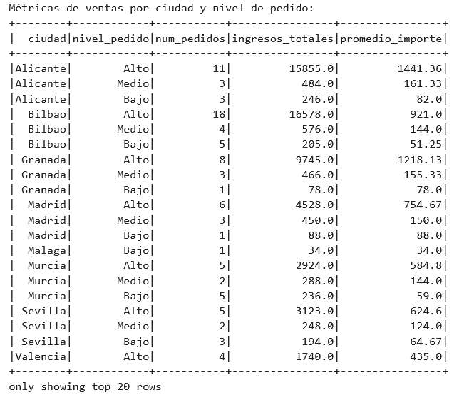
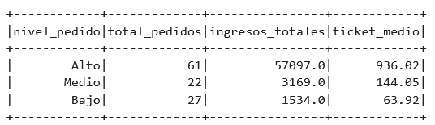
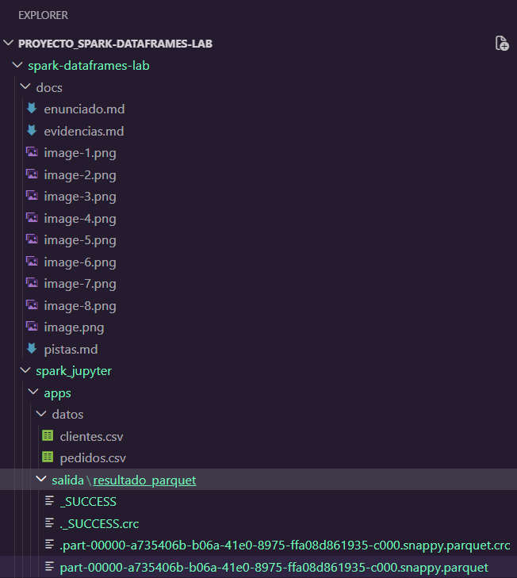
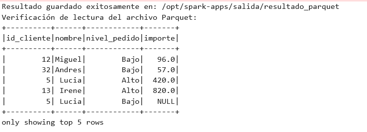

# Evidencias de la práctica

Incluye aquí capturas o salidas relevantes del cuaderno.

## 1. Entorno levantado
- Captura de JupyterLab 
- Captura del Spark Master UI 

## 2. Lectura de datos
- Esquema de `clientes` 
- Esquema de `pedidos` 
- Muestra inicial de datos 

## 3. Limpieza
- Resultado tras `trim` 
- Eliminación de duplicados 
- Tratamiento de valores nulos 

## 4. Join
- Resultado del join entre clientes y pedidos 
- Explicación breve de los registros perdidos 
    ¿Por qué se pierden registros?

        1. Pedidos sin Cliente (Huérfanos): Si en la tabla de pedidos hay registros con un id_cliente que no aparece en la tabla de clientes, esos pedidos se descartan. Esto suele ocurrir por errores en la exportación de datos o falta de integridad referencial en el sistema de origen.

        2. Clientes sin Pedidos: Si un cliente está registrado pero nunca ha realizado una compra, aparecerá en la tabla clientes pero no en la de pedidos. El inner join lo eliminará del resultado final porque no tiene transacciones asociadas.

        3. Inconsistencias en los IDs: A veces, aunque el cliente exista, si el ID tiene formatos distintos (por ejemplo, un espacio extra como " 5" vs "5"), Spark no los reconocerá como iguales y descartará la unión.

## 5. Agregaciones
- Resumen por ciudad y segmento 
- Interpretación breve de los resultados 
        Interpretación de resultados (Agregaciones)

        Tras analizar las métricas de ventas agrupadas por ciudad y nivel de pedido, se observan las siguientes conclusiones:

            Dominio de pedidos "Alto": En la mayoría de las ciudades (como Alicante, Bilbao y Granada), el mayor volumen de ingresos proviene de pedidos categorizados como "Alto" (>= 200€). Esto indica que el ticket promedio de estos clientes es elevado y representan el motor principal de ingresos.

            Distribución geográfica: Ciudades como Bilbao y Alicante destacan por tener una cantidad significativa de pedidos de alto valor (18 y 11 pedidos respectivamente), lo que sugiere que son mercados clave para la empresa.

            Eficiencia de ventas: El promedio_importe nos permite ver que, aunque en algunas ciudades hay pocos pedidos, estos son muy rentables. Por ejemplo, en Alicante, el promedio de los pedidos "Alto" supera los 1.400€, lo que indica ventas individuales de gran volumen.

            Segmentos minoritarios: Los pedidos de nivel "Bajo" y "Medio" tienen una frecuencia mucho menor y aportan una suma total de ingresos reducida en comparación con el segmento superior, lo que sugiere que el modelo de negocio está muy orientado a clientes de tipo Premium o compras de gran escala.

## 6. SQL
- Consulta SQL realizada 
    Consulta SQL:
        query_sql = """
            SELECT 
                nivel_pedido, 
                COUNT(*) as total_pedidos, 
                SUM(importe) as ingresos_totales,
                ROUND(AVG(importe), 2) as ticket_medio
            FROM ventas_reporte
            GROUP BY nivel_pedido
            ORDER BY ingresos_totales DESC
        """
- Resultado obtenido 

## 7. Parquet
- Escritura del resultado 
- Lectura posterior del fichero Parquet 
