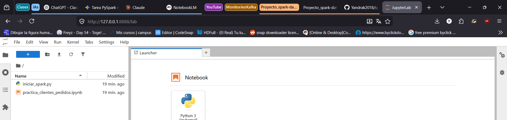
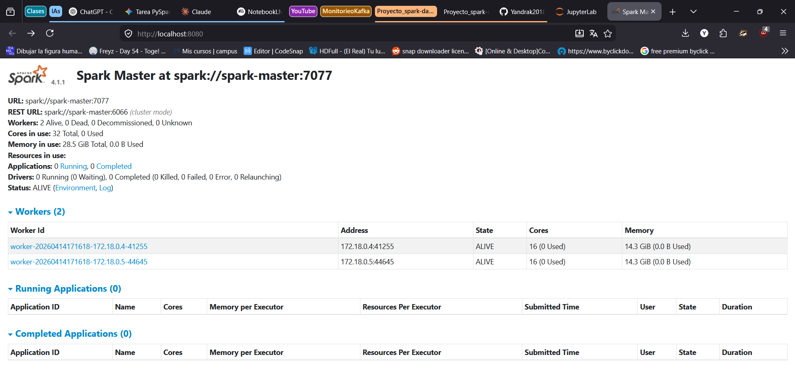
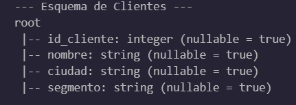
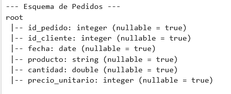
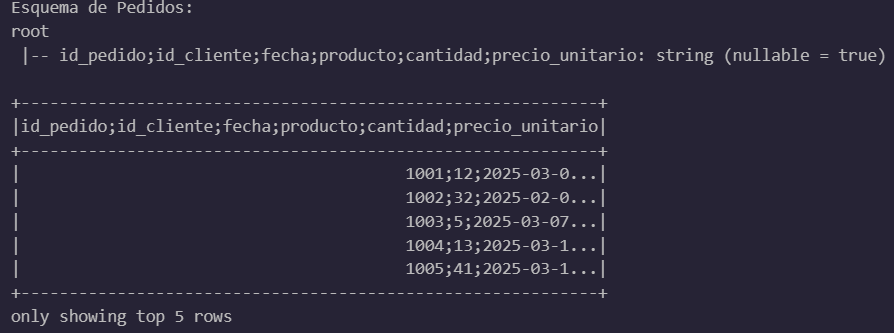
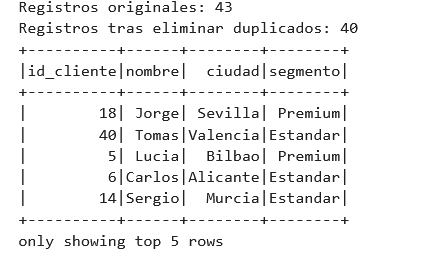
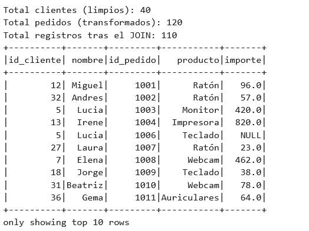

# Evidencias de la práctica

Incluye aquí capturas o salidas relevantes del cuaderno.

## 1. Entorno levantado
- Captura de JupyterLab 
- Captura del Spark Master UI 

## 2. Lectura de datos
- Esquema de `clientes` 
- Esquema de `pedidos` 
- Muestra inicial de datos 

## 3. Limpieza
- Resultado tras `trim` 
- Eliminación de duplicados 
- Tratamiento de valores nulos 

## 4. Join
- Resultado del join entre clientes y pedidos 
- Explicación breve de los registros perdidos 
    ¿Por qué se pierden registros?

        1. Pedidos sin Cliente (Huérfanos): Si en la tabla de pedidos hay registros con un id_cliente que no aparece en la tabla de clientes, esos pedidos se descartan. Esto suele ocurrir por errores en la exportación de datos o falta de integridad referencial en el sistema de origen.

        2. Clientes sin Pedidos: Si un cliente está registrado pero nunca ha realizado una compra, aparecerá en la tabla clientes pero no en la de pedidos. El inner join lo eliminará del resultado final porque no tiene transacciones asociadas.

        3. Inconsistencias en los IDs: A veces, aunque el cliente exista, si el ID tiene formatos distintos (por ejemplo, un espacio extra como " 5" vs "5"), Spark no los reconocerá como iguales y descartará la unión.

## 5. Agregaciones
- Resumen por ciudad y segmento 
- Interpretación breve de los resultados 

## 6. SQL
- Consulta SQL realizada 
- Resultado obtenido 

## 7. Parquet
- Escritura del resultado 
- Lectura posterior del fichero Parquet 
